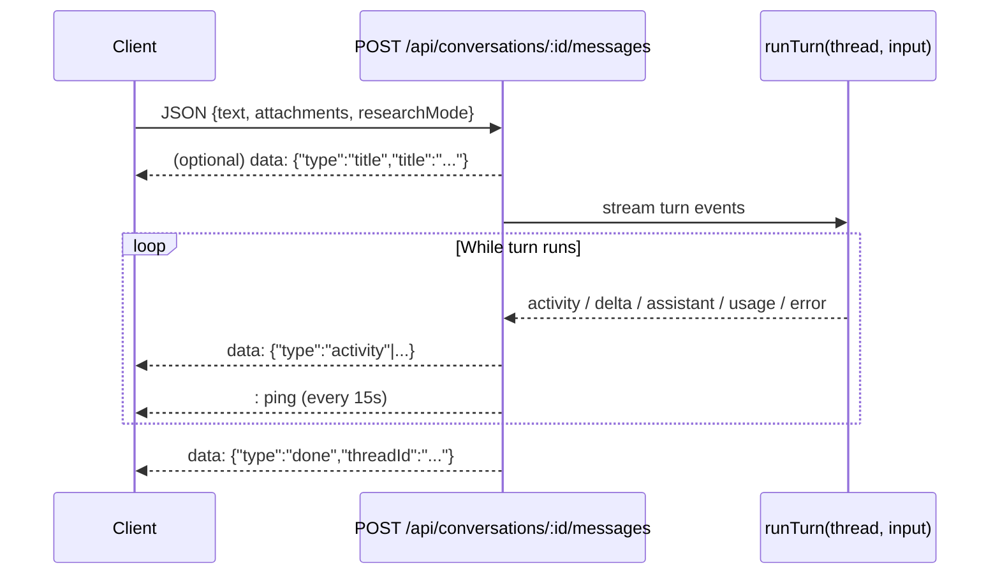

# REST endpoints

This page is the full HTTP and SSE reference for `server/index.js`. Endpoints are grouped by feature family and include method, path, request body, and response shape. The chat route is SSE and is documented separately with event details and a sequence diagram.

## Base information

- Base URL: `http://localhost:3939`
- JSON request limit: `10mb`
- Default response content type: JSON (except SSE and static file routes)

## Conversations metadata

| Method | Path | Request body | Response |
|---|---|---|---|
| `GET` | `/api/conversations` | none | `[{ id, title, projectId, updatedAt, createdAt }, ...]` sorted by `updatedAt` desc |
| `POST` | `/api/conversations` | `{ projectId? }` | `{ id, title, projectId, threadId, messages, createdAt, updatedAt }` |
| `GET` | `/api/conversations/:id` | none | Full conversation object; `404 { error: "not found" }` if missing |
| `PATCH` | `/api/conversations/:id` | `{ title }` | Updated conversation object; trims and caps title to 100 chars when valid |
| `DELETE` | `/api/conversations/:id` | none | `{ ok: true }` |

Conversation object shape:

```json
{
  "id": "uuid",
  "title": "New chat",
  "projectId": "uuid-or-null",
  "threadId": "string-or-null",
  "messages": [],
  "createdAt": 0,
  "updatedAt": 0
}
```

## Chat stream (SSE)

| Method | Path | Request body | Response |
|---|---|---|---|
| `POST` | `/api/conversations/:id/messages` | `{ text, attachments: [], researchMode }` | SSE stream (`text/event-stream`) |

Validation behavior:

- `404 { error: "not found" }` when conversation does not exist
- `400 { error: "empty message" }` when `text` is blank and `attachments` is empty

Expected attachment fields in request body:

```json
{
  "text": "User message",
  "attachments": [
    {
      "name": "file.txt",
      "url": "/files/uploads/...",
      "relPath": "uploads/...",
      "isImage": false
    }
  ],
  "researchMode": ""
}
```

### SSE event types

SSE frame format is `data: <json>\n\n` plus heartbeat comments `: ping\n\n` every 15 seconds.

| `type` | Shape | Meaning |
|---|---|---|
| `title` | `{ type: "title", title }` | Auto-title generated from first user message when current title is `"New chat"` |
| `activity` | `{ type: "activity", id, kind, label, detail, output?, exitCode?, done }` | Live timeline item (reasoning, command, search, file, tool, plan, error) |
| `assistant_delta` | `{ type: "assistant_delta", text }` | In-progress assistant text |
| `assistant` | `{ type: "assistant", text }` | Completed assistant text segment |
| `usage` | `{ type: "usage", usage }` | Turn usage payload from Codex completion |
| `error` | `{ type: "error", message }` | Failure surfaced by the turn pipeline |
| `done` | `{ type: "done", threadId }` | Terminal event for successful stream completion |

### SSE sequence



### Example curl (create + stream)

```bash
CONV=$(curl -s -X POST localhost:3939/api/conversations | python3 -c "import sys,json;print(json.load(sys.stdin)['id'])")
curl -s -N -X POST localhost:3939/api/conversations/$CONV/messages \
  -H "Content-Type: application/json" -d '{"text":"Say pong."}'
```

## Projects

| Method | Path | Request body | Response |
|---|---|---|---|
| `GET` | `/api/projects` | none | `[project, ...]` |
| `POST` | `/api/projects` | `{ name, instructions? }` | `project` or `400 { error }` |
| `PATCH` | `/api/projects/:id` | `{ name?, instructions? }` | updated `project` or `400 { error }` |
| `DELETE` | `/api/projects/:id` | none | `{ ok: true }` |
| `POST` | `/api/projects/:id/files` | multipart field `files` (max 16 files, 50MB each) | `{ files: [originalName, ...] }` |
| `GET` | `/api/projects/:id/files` | none | `{ files: [filename, ...] }` (empty array when directory missing) |

Project shape:

```json
{
  "id": "uuid",
  "name": "Project name",
  "instructions": "",
  "createdAt": 0
}
```

## Scheduled tasks

| Method | Path | Request body | Response |
|---|---|---|---|
| `GET` | `/api/tasks` | none | `[task, ...]` |
| `POST` | `/api/tasks` | `{ prompt, schedule }` | `task` or `400 { error }` |
| `PATCH` | `/api/tasks/:id` | partial task fields | updated `task` or `400 { error }` |
| `DELETE` | `/api/tasks/:id` | none | `{ ok: true }` |
| `POST` | `/api/tasks/:id/run` | none | `{ ok: true, started: true }` (run continues async) |

Task shape:

```json
{
  "id": "uuid",
  "prompt": "Do X",
  "schedule": { "type": "interval", "minutes": 60 },
  "enabled": true,
  "conversationId": null,
  "lastRun": null,
  "lastStatus": null,
  "nextRun": 0,
  "createdAt": 0
}
```

## MCP connectors

| Method | Path | Request body | Response |
|---|---|---|---|
| `GET` | `/api/mcp` | none | `{ servers, catalog, uvAvailable }` or `500 { error }` |
| `POST` | `/api/mcp/install` | `{ name, command, args?, env?, url? }` | `{ ok: true }` or `400 { error }` |
| `DELETE` | `/api/mcp/:name` | none | `{ ok: true }` or `400 { error }` |

`GET /api/mcp` response shape:

```json
{
  "servers": [
    {
      "name": "playwright",
      "command": "npx",
      "args": ["-y", "@playwright/mcp@latest", "--headless", "--isolated"],
      "enabled": true,
      "appInstalled": true
    }
  ],
  "catalog": [
    {
      "id": "playwright",
      "title": "Playwright (browser automation)",
      "description": "...",
      "command": "npx",
      "args": ["..."],
      "needs": null,
      "available": true,
      "installed": true
    }
  ],
  "uvAvailable": true
}
```

## Global uploads

| Method | Path | Request body | Response |
|---|---|---|---|
| `POST` | `/api/upload` | multipart field `files` (max 8 files, 50MB each) | `{ files: [{ name, path, relPath, url, mime, isImage }] }` |

Upload response entry:

```json
{
  "name": "photo.png",
  "path": "/abs/path/to/workspace/uploads/...",
  "relPath": "uploads/...",
  "url": "/files/uploads/...",
  "mime": "image/png",
  "isImage": true
}
```

## Memory and settings

| Method | Path | Request body | Response |
|---|---|---|---|
| `GET` | `/api/memory` | none | `{ memory }` |
| `PUT` | `/api/memory` | `{ memory }` | `{ ok: true }` |
| `GET` | `/api/settings` | none | `{ customInstructions, nickname, memoryEnabled, model, reasoningEffort }` |
| `PUT` | `/api/settings` | partial settings object | merged settings object |

## Static mounts

| Method | Path | Source | Purpose |
|---|---|---|---|
| `GET` | `/` | `public/` | App UI |
| `GET` | `/files/*` | `workspace/` | Uploaded/generated files |
| `GET` | `/vendor/marked.js` | `node_modules/marked/marked.min.js` | Markdown parser |
| `GET` | `/vendor/purify.js` | `node_modules/dompurify/dist/purify.min.js` | HTML sanitizer |
| `GET` | `/vendor/hljs/*` | `node_modules/@highlightjs/cdn-assets/*` | Syntax highlight assets |

## Related docs

- [API overview](index.md)
- [SSE chat pipeline](../systems/sse-chat-pipeline.md)
- [Codex integration](../systems/codex-integration.md)
- [Data models](../reference/data-models.md)
- [Security](../security.md)
