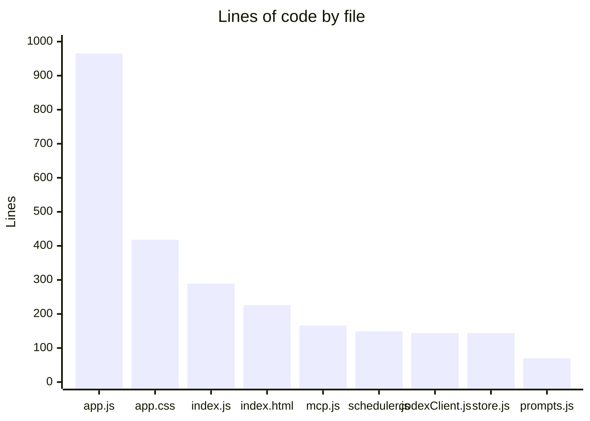
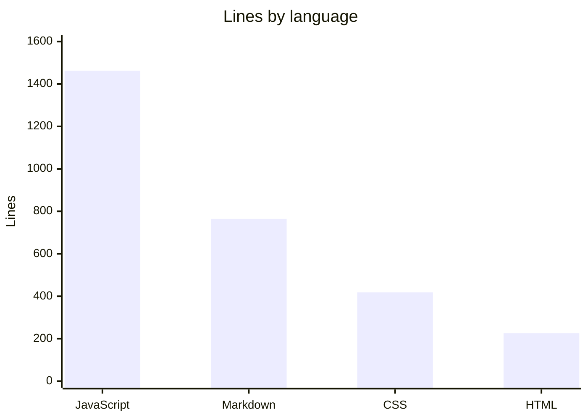

# By the numbers

A quantitative snapshot of the MockChatGPT codebase. Data collected on 2026-07-27.

## Size

The repository is small and single-purpose: about 3,200 tracked source lines across JavaScript, CSS, HTML, and markdown, plus the `package-lock.json`.

| Area | Files | Lines |
|---|---|---|
| Frontend (`public/`) | 3 (`app.js`, `app.css`, `index.html`) | 1,609 |
| Server (`server/`) | 6 ES modules | 862 |
| Docs (`docs/`) | 5 markdown research notes | 495 |
| Root docs | `README.md`, `AGENTS.md`, `CLAUDE.md` | ~270 |

The single largest source file is `public/app.js` at 965 lines — the entire frontend in one script. The server is spread across six focused modules, none over 289 lines.

## Language mix

JavaScript dominates (frontend + server), followed by markdown documentation, then CSS and HTML.

## Structure

- **No build system.** No bundler, transpiler, or test runner. `npm start` runs `node server/index.js` directly.
- **6 runtime dependencies:** `@openai/codex-sdk`, `express`, `multer`, `marked`, `dompurify`, `@highlightjs/cdn-assets`. No dev dependencies.
- **0 test files.** Verification is manual (curl SSE smoke test or the browser).
- **3 vendored client libraries** served out of `node_modules` via static mounts.

## Activity

The project was built in a single burst on **2026-07-27** across 7 commits:

| Commit | Scope | Change |
|---|---|---|
| `5b1e2cb` | Initial app | 15 files, +2,886 |
| `b69dda4` | Capability-matrix doc | +109 |
| `9cc44c2` | Bubble-collapse fix, doc update | +17 / -6 |
| `e0a3649` | Model/effort picker + thinking timeline | +293 / -72 |
| `44f5ae5` | Drag-drop/paste uploads, network sandbox, docs | +48 / -6 |
| `b977ad4` | Repo-root AGENTS.md + CLAUDE.md | +66 |
| `b2a196c` | Scheduled tasks, projects, deep research, MCP manager | 11 files, +1,124 / -14 |

The two largest commits are the initial scaffold (`5b1e2cb`) and the feature bundle (`b2a196c`) that added scheduled tasks, projects, deep-research modes, and the connector manager. See [Lore](lore.md) for the narrative.

## Churn hotspots

The most-changed files across the short history are the frontend (`public/app.js`, touched by nearly every feature commit) and `server/index.js` (routes added for each new subsystem). Both grew steadily rather than being rewritten.

## Bot-attributed commits

**0%.** No commits carry bot co-authorship trailers (`factory-droid[bot]`, `dependabot[bot]`, `github-actions[bot]`, `copilot[bot]`). This is a lower bound on AI assistance, since inline AI tools leave no git trace, and the repo-root `CLAUDE.md` shows the project is developed with AI agent tooling that does not necessarily add co-author trailers.

## Complexity

- **Average server module:** ~144 lines. The largest is `server/index.js` (289).
- **Frontend concentration:** the entire client is one 965-line script plus a 418-line stylesheet.
- **Deepest data nesting:** conversation JSON, where each assistant message embeds an `activities[]` array of agent-action records.

For dependency detail see [Dependencies](reference/dependencies.md); for the data shapes see [Data models](reference/data-models.md).
