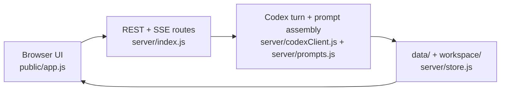

# Features

MockChatGPT ships end-to-end features that combine frontend controls in `public/app.js`, REST endpoints in `server/index.js`, and agent behavior from `server/prompts.js`, `server/codexClient.js`, and `workspace/AGENTS.md`. This section maps each user-facing capability to its implementation entry points.

## Purpose

Provide a feature-oriented index so contributors can move from product behavior to the exact UI code, API routes, and agent rules behind it.

## How it works

## Feature pages

| Feature | What it covers |
|---|---|
| [Chat and streaming](chat-and-streaming.md) | Composer send flow, SSE-driven live timeline, markdown/code rendering, auto-titling, sidebar history grouping, model/reasoning picker |
| [Deep research](deep-research.md) | Research mode picker and the Wide vs Deep per-turn protocols |
| [File and image handling](file-and-image-handling.md) | Upload ingestion, attachment wiring to the agent, and generated image/artifact output |
| [Memory and personalization](memory-and-personalization.md) | `memory.md`, nickname, custom instructions, and settings-driven preamble injection |
| [Projects](projects.md) | Project CRUD, project file storage, project-scoped prompt context, and sidebar filtering |
| [Scheduled tasks](scheduled-tasks.md) | Task schedules, scheduler loop, run-now/pause/resume flow, and task-run conversations |
| [Connectors](connectors.md) | MCP catalog/custom install flow, in-chat approval cards, and global Codex connector effects |

## Key source files

| File | Why it matters |
|---|---|
| `public/app.js` | Frontend interactions for chat, uploads, settings, projects, tasks, and connectors |
| `server/index.js` | API surface and SSE chat route that ties frontend actions to backend behavior |
| `server/store.js` | Persistence paths and JSON/file lifecycle for conversations, settings, projects, and workspace directories |
| `server/prompts.js` | First-turn preamble builder and research mode protocol injection |
| `server/codexClient.js` | Codex thread options plus streamed event mapping into app-visible activity events |
| `server/scheduler.js` | Scheduled task model, next-run computation, and task execution loop |
| `server/mcp.js` | Curated connector catalog and `codex mcp` install/remove/list integration |
| `workspace/AGENTS.md` | Runtime persona rules for file reading, generated artifacts, memory, and connector proposal protocol |

## Integration points

- API behavior: [API overview](../api/index.md) and full route reference in [REST endpoints](../api/rest-endpoints.md).
- Chat internals: [SSE chat pipeline](../systems/sse-chat-pipeline.md) and [Codex integration](../systems/codex-integration.md).
- Persistence and data contracts: [Persistence](../systems/persistence.md), [Data models](../reference/data-models.md), and [Configuration](../reference/configuration.md).
- System context: [Architecture](../overview/architecture.md).

## Entry points for modification

- Add a new user feature: start in `public/app.js` for UI state and interactions, then wire/extend routes in `server/index.js`.
- Change agent-facing behavior: adjust `server/prompts.js` and, when needed, `workspace/AGENTS.md`.
- Change runtime persistence: update `server/store.js` and related feature modules (`server/scheduler.js`, `server/mcp.js`).
