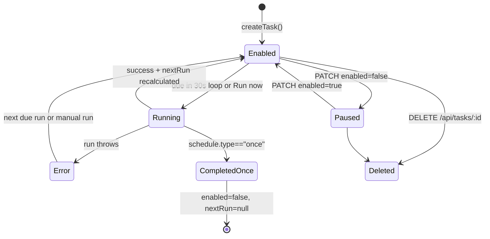

# Scheduled tasks

Scheduled tasks run real agent turns on a clock and store results in normal conversations. Each task has a schedule, status, and optional linked conversation, managed through the Tasks modal and `server/scheduler.js`.

## Purpose

Automate recurring or one-time prompts while preserving full chat history and activity traces.

## How it works

```mermaid
flowchart LR
  UI[Tasks modal<br/>create/run/pause/resume/delete] --> API[`/api/tasks` + `/api/tasks/:id/run`]
  API --> Tasks[`data/tasks.json`]
  Loop[`startScheduler()` every 30s] --> Due[Find enabled due tasks]
  Due --> Bump[Bump `nextRun` first]
  Bump --> Run[`runTask(id)`]
  Run --> Conv[Create/reuse conversation<br/>title starts with `⏰ `]
  Conv --> Turn[Append scheduled user message<br/>run Codex turn]
  Turn --> Save[Save assistant text + activities<br/>update `lastRun/lastStatus/nextRun`]
```

### Schedule types and next-run calculation

`computeNextRun(schedule, from)` supports:

- `{ type: "interval", minutes }` (minimum 5-minute effective interval via `Math.max(5, minutes)`),
- `{ type: "daily", time: "HH:MM" }`,
- `{ type: "weekly", weekday: 0-6, time: "HH:MM" }`,
- `{ type: "once", at: ISO }`.

`once` tasks disable themselves after successful execution (`nextRun: null`, `enabled: false`).

### Task run lifecycle

- Manual run: `POST /api/tasks/:id/run` starts `runTask()` asynchronously.
- `runTask()` creates/reuses a conversation, sets title to `⏰ ` + truncated prompt, and appends a user message:
  - ``[Scheduled run — <local timestamp>]\n<prompt>``.
- It runs the agent turn with extra lead text:
  - ``[This is an automated scheduled task run at <timestamp>. Complete the task and report the result.]``.
- Assistant results are persisted with `activities` and `durationMs`, same shape as normal chat turns.

### Task state model



## Key source files

| File | Why it matters |
|---|---|
| `public/app.js` | Tasks modal form fields (`daily/weekly/interval/once`), run/pause/resume/view/delete controls |
| `server/index.js` | Tasks REST routes and manual run trigger endpoint |
| `server/scheduler.js` | Task model persistence, `computeNextRun`, `runTask`, 30s loop and due-run safety bump |
| `server/store.js` | Conversation read/write APIs used when task runs create or update chat history |
| `server/prompts.js` | Supplies first-turn preamble if a task creates a new conversation thread |

## Integration points

- Full route definitions are in [REST endpoints](../api/rest-endpoints.md); overview in [API index](../api/index.md).
- Task runs reuse the same streamed chat pathway described in [SSE chat pipeline](../systems/sse-chat-pipeline.md) and [Chat and streaming](chat-and-streaming.md).
- Persisted task and conversation records tie to [Persistence](../systems/persistence.md) and [Data models](../reference/data-models.md).

## Entry points for modification

- Add new schedule types or policies: extend `computeNextRun()` and task form serialization in `public/app.js`.
- Change retry/safety behavior: update `startScheduler()` and `runTask()` in `server/scheduler.js`.
- Change UI controls or task metadata display: `refreshTasks()` and related modal handlers in `public/app.js`.
