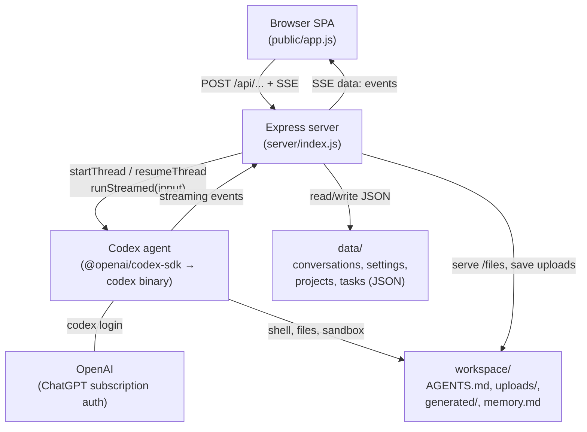
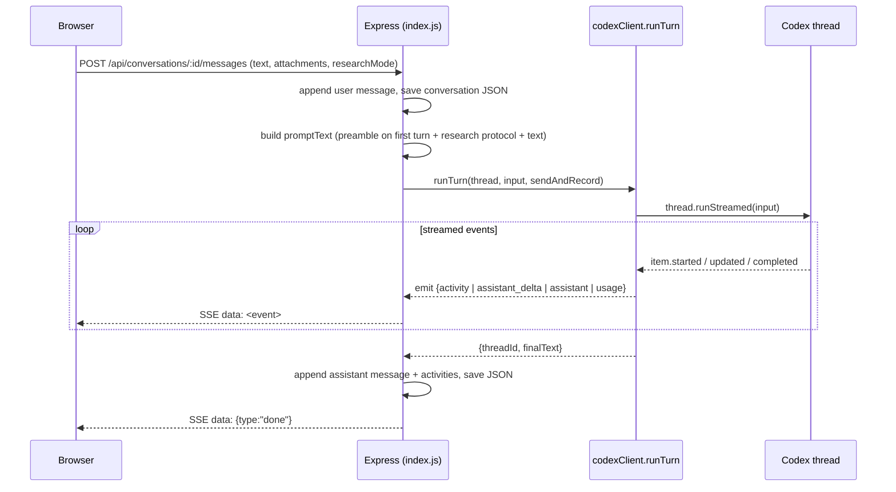
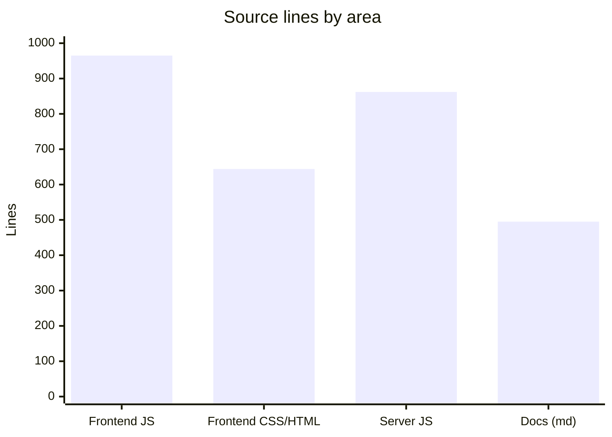

# Architecture

MockChatGPT has three layers: a vanilla-JS browser client, an Express server that streams chat over SSE, and the Codex agent (running on the local `codex` binary) that does the actual work. State lives in two directories on disk: `data/` for app records and `workspace/` for the agent's sandbox.

## The big picture

## Layers

### Browser SPA (`public/`)

A single HTML page (`index.html`), one stylesheet (`app.css`), and one script (`app.js`, ~965 lines). No framework and no build step. It renders the ChatGPT-style shell (sidebar, composer, modals), issues `fetch` calls to the `/api/*` routes, and consumes the SSE stream for chat. Markdown is rendered with vendored `marked`, sanitized with `dompurify`, and code is highlighted with `highlight.js`. See [Frontend architecture](../systems/frontend-architecture.md).

### Express server (`server/`)

Six ES modules totaling under 900 lines:

| Module | Responsibility |
|---|---|
| `index.js` | Express routes, static serving, the SSE chat endpoint |
| `codexClient.js` | Codex thread options + streaming event → SSE event mapping |
| `prompts.js` | First-turn preamble (persona, memory, instructions) and research protocols |
| `store.js` | JSON persistence for conversations, projects, settings, memory |
| `scheduler.js` | Scheduled-task engine (interval loop, next-run computation) |
| `mcp.js` | MCP connector catalog + install/remove via `codex mcp` |

The server also vends the client libraries out of `node_modules` through static mounts (`/vendor/marked.js`, `/vendor/purify.js`, `/vendor/hljs`) so the frontend needs no CDN.

### Codex agent

Each conversation maps to one persistent Codex **thread**. The server calls `startThread` on the first turn and `resumeThread(threadId, options)` on later turns, so context survives server restarts. The SDK drives the locally installed `codex` binary, which authenticates with the user's ChatGPT subscription. The agent runs with `sandboxMode: "workspace-write"` and network access enabled, scoped to the `workspace/` directory. See [Codex integration](../systems/codex-integration.md).

## Request lifecycle: sending a message

The server accumulates every `agent_message` item (Codex emits progress notes plus a final answer, not token-level deltas) and forwards each agent action as an `activity` event that the UI renders into the live "thinking" timeline. See [SSE chat pipeline](../systems/sse-chat-pipeline.md).

## Data flow and storage

- **`data/conversations/<id>.json`** — one file per chat: title, `threadId`, message array (each assistant message stores its `activities` timeline and `durationMs` for replay).
- **`data/settings.json`** — nickname, custom instructions, `memoryEnabled`, model, reasoning effort.
- **`data/projects.json`**, **`data/tasks.json`**, **`data/mcp-app-installed.json`** — projects, scheduled tasks, and the list of connectors installed through the app.
- **`workspace/`** — the agent's sandbox: `AGENTS.md` (its persona), `uploads/` (user files), `projects/<id>/` (per-project files), `generated/` (agent output), and `memory.md` (cross-chat memory).

Note that `data/`, `workspace/uploads/`, `workspace/generated/`, and `workspace/memory.md` are gitignored: they are runtime state, not source. See [Data models](../reference/data-models.md).

## Language breakdown

Roughly 1,600 lines of frontend (JS + CSS + HTML), 862 lines of server JS across six modules, and ~500 lines of research documentation under `docs/`. See [By the numbers](../by-the-numbers.md) for the full breakdown.

## Key design decisions

- **Codex thread per conversation.** Persistence and context continuity come for free from `resumeThread`; the app stores only the `threadId`.
- **Accumulate agent messages.** Codex emits multiple whole `agent_message` items per turn. The pipeline concatenates them rather than keeping the last, so progress notes are not lost.
- **Persona lives in `workspace/AGENTS.md`.** The standing "you are MockChatGPT" instructions are loaded by Codex from the workspace, separate from the per-turn preamble in `prompts.js`.
- **No framework on the frontend.** Kept intentionally dependency-free; new client libraries are vendored via static mounts, never a CDN.

For the reasoning behind these choices and the capability gaps versus real ChatGPT, see [Getting started](getting-started.md) and the [Glossary](glossary.md).
