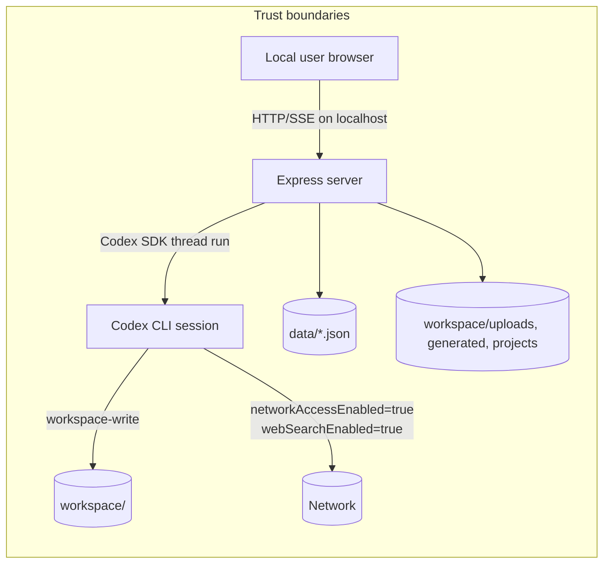

# Security

MockChatGPT is designed for one local user on `localhost`. The server has no authentication, and the Codex agent runs with `workspace-write` plus network access, so exposing this app to other machines would hand them direct agent control.

## Trust model and boundaries

The browser trusts the local server API, and the server trusts the Codex agent's response stream. The agent is sandboxed to `workspace/`, but it can run shell commands and use the network.

Related architecture: [Overview](./overview/architecture.md), [Codex integration](./systems/codex-integration.md), [Persistence](./systems/persistence.md).

## Why localhost-only is mandatory

- `server/codexClient.js` sets `sandboxMode: "workspace-write"` and `networkAccessEnabled: true`.
- The agent can execute commands (`command_execution` events in `server/codexClient.js`) and edit files in `workspace/`.
- `server/index.js` exposes API routes with no auth middleware.

If the port is reachable beyond localhost, anyone who can hit it can send prompts, run tool-enabled tasks, and trigger uploads/project operations.

## Input validation and sanitization

| Surface | Validation/sanitization | Source |
|---|---|---|
| Conversation id file path | Rejects ids that do not match `/^[\\w-]+$/` before building `data/conversations/<id>.json` path | `server/store.js` (`convPath`) |
| Upload filename (`/api/upload`) | Replaces chars outside `[\\w.\\-() ]` with `_` | `server/index.js` (`multer` filename) |
| Project id path segment | Strips chars outside `[\\w-]` when building `workspace/projects/<id>` path | `server/index.js` (project upload/list routes) |
| Project upload filename | Replaces chars outside `[\\w.\\-() ]` with `_` | `server/index.js` (project `multer` filename) |
| MCP server name | Must match `/^[\\w-]{1,40}$/` | `server/mcp.js` (`installServer`, `removeServer`) |
| MCP env keys | Must match `/^[A-Z_][A-Z0-9_]*$/i` | `server/mcp.js` (`installServer`) |
| MCP CLI invocation | Uses `execFile("codex", ["mcp", ...args])`, not shell string execution | `server/mcp.js` (`codexMcp`) |

## Output sanitization (XSS guard)

Agent/user markdown is rendered with `marked.parse(...)` and sanitized by `DOMPurify.sanitize(...)` before insertion into the DOM. This is the main client-side XSS guard for chat content.

Source: `public/app.js` (`renderMarkdown`).

## Upload limits

| Endpoint | Max files | Max size per file | Source |
|---|---:|---:|---|
| `POST /api/upload` | 8 | 50 MB | `server/index.js` (`upload.array("files", 8)`, `limits.fileSize`) |
| `POST /api/projects/:id/files` | 16 | 50 MB | `server/index.js` (`projectUpload.array("files", 16)`, `limits.fileSize`) |

## Connector install/remove safety and scope

- Connector management uses `codex mcp` via `execFile`, with array args and `timeout: 30000` (`server/mcp.js`).
- This avoids shell interpolation in command construction.
- Installed connectors are global to the local Codex setup, not isolated to this app. The UI explicitly warns: removing a connector affects all Codex sessions (`public/app.js`, connectors modal).
- App-tracked connector names are stored in `data/mcp-app-installed.json` (`server/mcp.js`).

See also: [Connectors feature](./features/connectors.md).

## Secrets and sensitive runtime state posture

- Repository code does not use API keys for model access; auth is via local `codex login` session (`@openai/codex-sdk` + local `codex` CLI flow).
- `.gitignore` excludes runtime-sensitive/local state:
  - `data/`
  - `workspace/uploads/`
  - `workspace/generated/`
  - `workspace/memory.md`
  - `.DS_Store`
  - `*.log`

Source: `.gitignore`.

## What to be careful about

- Do not expose this server outside localhost unless you add robust authn/authz and reassess the agent sandbox model.
- Keep filename/id validation patterns intact when changing routes or persistence code.
- Keep markdown sanitization (`DOMPurify`) in the render path for all untrusted content.
- Treat connector changes as machine-global Codex config changes.
- Preserve persistence boundaries and gitignore rules for `data/` and `workspace/` runtime artifacts.

Contributor guidance: [Patterns and conventions](./how-to-contribute/patterns-and-conventions.md).
