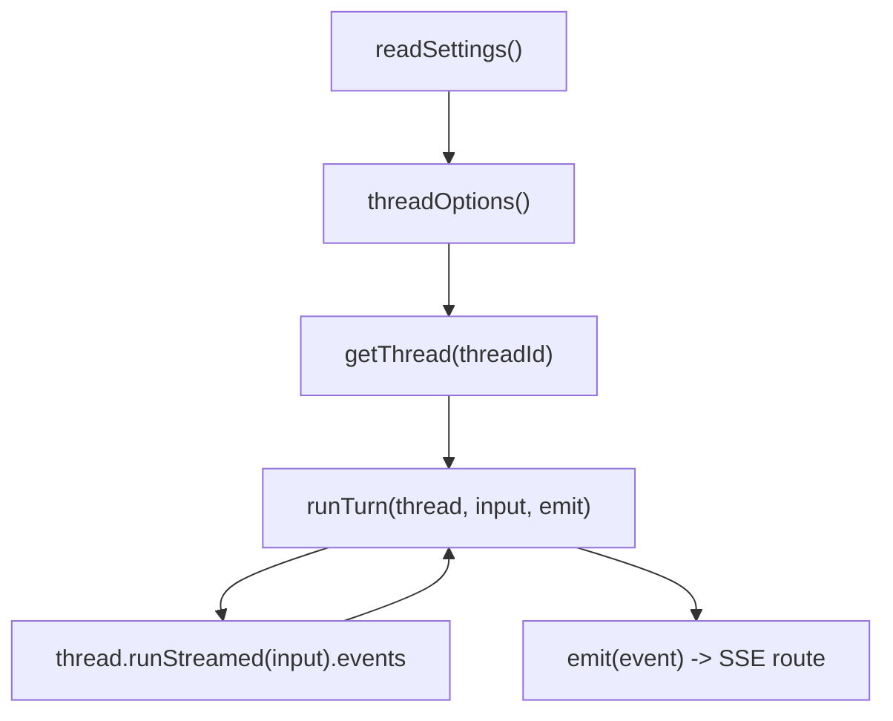

# Codex integration

`server/codexClient.js` is the adapter between `@openai/codex-sdk` and the app protocol used by the SSE route. It controls thread options and normalizes Codex streamed events into the event types the frontend understands.

## Purpose

Document how threads are configured and how `runTurn` maps SDK events to app events.

## Key source files

| File | Why it matters |
|---|---|
| `server/codexClient.js` | `threadOptions`, `getThread`, `runTurn`, output truncation |
| `server/store.js` | `WORKSPACE` and `readSettings()` consumed by `threadOptions()` |
| `server/index.js` | Calls `getThread` and `runTurn` inside the SSE chat route |

## Key abstractions

| Name | File | Description |
|---|---|---|
| `threadOptions()` | `server/codexClient.js` | Builds per-turn SDK options from persisted settings |
| `getThread(threadId)` | `server/codexClient.js` | Chooses `codex.startThread(opts)` or `codex.resumeThread(threadId, opts)` |
| `runTurn(thread, input, emit)` | `server/codexClient.js` | Iterates streamed events and emits normalized app events |
| `truncate(s, n)` | `server/codexClient.js` | Truncates command output to `n` chars (`4000` in command mapping) |

## How it works

## Thread options

`threadOptions()` always sets:

- `workingDirectory: WORKSPACE`
- `skipGitRepoCheck: true`
- `sandboxMode: "workspace-write"`
- `networkAccessEnabled: true`
- `webSearchEnabled: true`

It conditionally sets:

- `opts.model = settings.model.trim()` when `settings.model` is non-empty
- `opts.modelReasoningEffort = settings.reasoningEffort.trim()` when non-empty

Because settings are read each call, model/effort updates apply on subsequent turns for existing conversations too.

## Thread lifecycle: start vs resume

`getThread(threadId)` behavior:

- If `threadId` exists: `codex.resumeThread(threadId, opts)`
- Else: `codex.startThread(opts)`

The SSE handler in `server/index.js` persists returned `thread.id` as `conv.threadId`, so later messages stay in the same Codex thread context.

## Event mapping in `runTurn`

`runTurn` awaits `thread.runStreamed(input)` and loops `for await (const event of events)`.

### Item event mapping (`item.started`, `item.updated`, `item.completed`)

| `item.type` | App event emitted | Fields |
|---|---|---|
| `agent_message` | `{ type: "assistant_delta" }` while updating, `{ type: "assistant" }` on complete | `text: finalText` (accumulated message text) |
| `reasoning` | `{ type: "activity", kind: "reasoning" }` | `label: "Thinking"`, `detail` from `item.text` or `summary[]`/`content[]`, `done` |
| `command_execution` | `{ type: "activity", kind: "command" }` | `label: "Running command"` or `"Ran command"`, `detail: item.command`, `output` (completed only, truncated to 4000), `exitCode`, `done` |
| `web_search` | `{ type: "activity", kind: "search" }` | `label` switches between in-progress/completed, `detail: item.query`, `done` |
| `file_change` | `{ type: "activity", kind: "file" }` | `label` switches between in-progress/completed, `detail` is joined changed paths, `done` |
| `mcp_tool_call` | `{ type: "activity", kind: "tool" }` | `label: "Using <server>"`, `detail: item.tool`, `done` |
| `todo_list` | `{ type: "activity", kind: "plan" }` | `label: "Planning"`, `detail` is joined checklist lines from `item.items`, `done` |
| `error` | `{ type: "activity", kind: "error" }` | `label: "Error"`, `detail: item.message`, `done: true` |

All activity emissions include `id` when available (`item.id || null`).

### Turn/error-level mapping

| SDK event type | App event emitted |
|---|---|
| `turn.completed` | `{ type: "usage", usage: event.usage }` |
| `turn.failed` | `{ type: "error", message: event.error?.message || "The turn failed." }` |
| `error` | `{ type: "error", message: event.message || "Unknown error" }` |

## Multi-agent_message accumulation gotcha

Codex can emit multiple complete `agent_message` items in one turn (progress notes + final answer). `runTurn` avoids overwriting by:

- keeping finished segments in `parts[]`
- tracking in-flight text in `partial`
- recomputing `finalText = parts.concat(partial ? [partial] : []).join("\n\n")`

Without this, only the latest message would remain.

## Integration points

- Upstream route: [SSE chat pipeline](./sse-chat-pipeline.md)
- Prompt composition and first-turn preamble source: [Memory and personalization](../features/memory-and-personalization.md)
- Research-mode protocol text source: [Deep research](../features/deep-research.md)
- API surface context: [API index](../api/index.md)

## Entry points for modification

- Change sandbox/network/model behavior: `threadOptions()`.
- Add or alter event types: `runTurn` switch on `item.type` and top-level `event.type`.
- Adjust command output policy: `truncate` usage in `command_execution` mapping.
