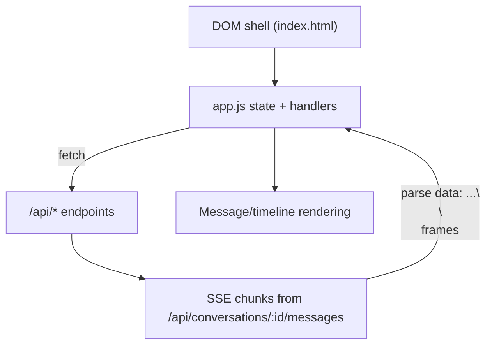

# Frontend architecture

The frontend is a single-page vanilla JavaScript app served from `public/`: `index.html` defines the shell, `app.js` handles state and behavior, and `app.css` handles styling/layout. There is no framework and no build step.

## Purpose

Show where client responsibilities live: rendering, SSE stream handling, composer/uploads, and modal-driven feature management.

## Key source files

| File | Why it matters |
|---|---|
| `public/index.html` | Static DOM shell (sidebar, topbar, chat area, composer, tasks/MCP/project/settings modals) |
| `public/app.js` | App state, API calls, SSE parsing, rendering, activity timeline, uploads, modal logic |
| `public/app.css` | Theme/layout/states and interaction styles, including hidden-state and bubble-width gotchas |
| `server/index.js` | Serves vendored libraries at `/vendor/marked.js`, `/vendor/purify.js`, `/vendor/hljs` |

## Key abstractions

| Name | File | Description |
|---|---|---|
| `$ = (sel) => document.querySelector(sel)` | `public/app.js` | Small selector helper used throughout |
| `renderMarkdown(md)` | `public/app.js` | Markdown render + sanitize + code block decoration/highlighting |
| `sendMessage()` | `public/app.js` | Sends user message, starts SSE fetch stream, drives assistant shell updates |
| `handleStreamEvent(ev, shell, markFinal)` | `public/app.js` | Applies streamed `title`, `activity`, `assistant_delta`, `assistant`, `error`, `done` |
| `buildAgentPanel` / `renderActivityEntry` | `public/app.js` | Builds and updates the “Thinking” timeline UI |
| `buildMcpInstallCard(jsonText)` | `public/app.js` | Converts `mcp-install` fenced code block JSON into approve/install UI card |

## How it works

## App structure in `app.js`

- Core state vars:
  - `conversations`, `currentConv`
  - `pendingAttachments`
  - `streaming`, `streamAbort`
  - `projects`, `selectedProjectId`, `editingProjectId`
  - `currentSettings` (model/reasoning effort)
  - `currentMode` (research mode)
- Markdown/rendering:
  - `marked.setOptions({ breaks: true, gfm: true })`
  - `renderMarkdown` sanitizes with `DOMPurify.sanitize(marked.parse(...))`
  - wraps code blocks with copy-button chrome; highlights with `hljs.highlightElement`
- Conversation/sidebar:
  - `loadConversations`, `renderConvList`, `openConversation`, `newChat`
  - date grouping via `groupLabel()`
- Streaming chat path:
  - `sendMessage` POSTs to `/api/conversations/:id/messages`
  - reads `ReadableStream` chunks via `reader.read()`
  - splits SSE frames on `\n\n`, parses `data: ...` JSON payloads
  - routes each event through `handleStreamEvent`
- Thinking timeline:
  - `addAssistantShell` starts expandable panel with live timer
  - `upsertActivity`/`renderActivityEntry` maintain per-activity nodes keyed by `id` or fallback key
  - `finalizeShell` collapses panel and freezes indicators when complete
- Composer and uploads:
  - autogrow textarea (`autogrow`)
  - Enter-to-send (Shift+Enter newline)
  - `uploadFiles` posts `FormData` to `/api/upload`
  - supports click-upload, drag/drop, and paste-from-clipboard file capture
- Feature modals and pickers:
  - Settings modal (`/api/settings`, `/api/memory`)
  - Model and reasoning effort picker (`#model-menu`, saves via PUT `/api/settings`)
  - Research mode picker (`#mode-menu`, values `""`, `wide`, `deep`)
  - Projects modal and project files API
  - Scheduled tasks modal (`/api/tasks` CRUD/run)
  - MCP connectors modal (`/api/mcp`, `/api/mcp/install`, uninstall route)
- MCP install approval card:
  - when markdown code block language is `mcp-install`, `buildMcpInstallCard` parses JSON and renders an “Approve & install” card that POSTs to `/api/mcp/install`.

## CSS conventions and gotchas

From `public/app.css`:

- Hidden-state override is explicit: `#modal-backdrop[hidden], .backdrop[hidden] { display: none; }` and `#model-menu[hidden] { display: none; }`.
- User bubble width rule is on `.msg.user .msg-box { max-width: 75%; ... }`, while `.bubble` uses `max-width: 100%`.
- The activity panel and timeline (`.agent-panel`, `.agent-timeline`, `.activity...`) style live “thinking” updates and command output collapsing.

## Vendored libraries

`public/index.html` loads:

- `/vendor/marked.js`
- `/vendor/purify.js`
- `/vendor/hljs/highlight.min.js`
- highlight.js theme CSS (`github.min.css`, `github-dark.min.css`)

These paths are provided by express static mounts in `server/index.js`.

## Integration points

- Server-side stream producer: [SSE chat pipeline](./sse-chat-pipeline.md)
- Codex event semantics: [Codex integration](./codex-integration.md)
- Feature internals: [Scheduled tasks](../features/scheduled-tasks.md), [Connectors](../features/connectors.md), [Deep research](../features/deep-research.md), [Memory and personalization](../features/memory-and-personalization.md)
- API surface: [API index](../api/index.md)

## Entry points for modification

- Stream/UI behavior changes: `sendMessage`, `handleStreamEvent`, `renderActivityEntry`.
- Markdown/render security behavior: `renderMarkdown`.
- Composer and attachments UX: `uploadFiles`, drag/drop/paste handlers, `renderAttachPreviews`.
- Modal and picker behavior: sections labeled settings/model/research/projects/tasks/MCP in `app.js`.
- Layout and visual states: `public/app.css`.
