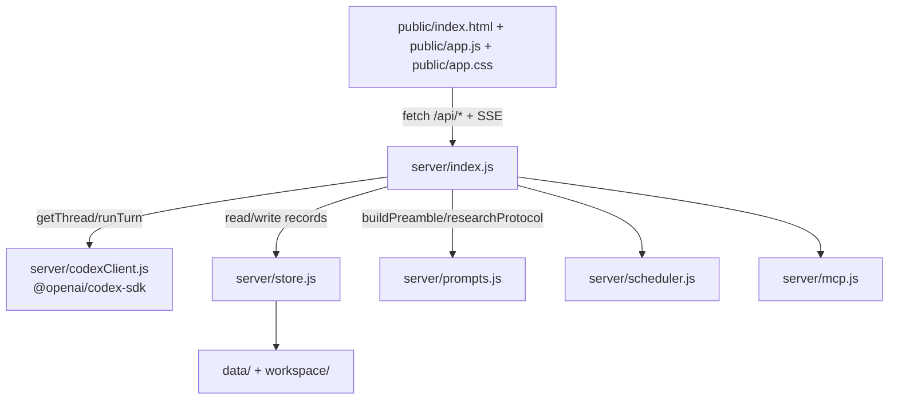

# Systems overview

This section documents the runtime building blocks behind MockChatGPT: the Express backend modules and the vanilla-JS frontend. For architecture context first, see [Architecture](../overview/architecture.md).

## Purpose

Use these pages to find where behavior lives before you edit routing, streaming, state persistence, or UI event flow.

## Key source files

| Component | File | What it does |
|---|---|---|
| API server and SSE route | `server/index.js` | Express app, static mounts, `/api/*` routes, `POST /api/conversations/:id/messages` streaming pipeline |
| Codex stream adapter | `server/codexClient.js` | Thread options, thread start/resume, Codex event mapping to app events |
| Persistence layer | `server/store.js` | JSON-file storage and path constants for conversations, settings, projects, memory |
| Prompt construction | `server/prompts.js` | First-turn preamble and research protocol text (documented in features pages) |
| Scheduled tasks | `server/scheduler.js` | Task scheduling and task execution APIs (documented in features pages) |
| MCP connectors | `server/mcp.js` | MCP server listing/install/remove APIs (documented in features pages) |
| Browser SPA | `public/index.html`, `public/app.js`, `public/app.css` | Chat shell, SSE stream consumption, rendering, composer/uploads, settings and feature modals |

## Key abstractions

| Name | File | Description |
|---|---|---|
| `app.post("/api/conversations/:id/messages")` | `server/index.js` | End-to-end chat request lifecycle and SSE output |
| `runTurn(thread, input, emit)` | `server/codexClient.js` | Converts Codex SDK stream events into frontend-consumable events |
| `saveConversation(conv)` | `server/store.js` | Conversation write path with `updatedAt` refresh |
| `handleStreamEvent(ev, shell, markFinal)` | `public/app.js` | Client-side SSE event dispatcher for live assistant output and activity timeline |

## How it works

## Systems pages

- [SSE chat pipeline](./sse-chat-pipeline.md)
- [Codex integration](./codex-integration.md)
- [Persistence](./persistence.md)
- [Frontend architecture](./frontend-architecture.md)

## Related feature docs

- [Scheduled tasks](../features/scheduled-tasks.md)
- [Connectors](../features/connectors.md)
- [Deep research](../features/deep-research.md)
- [Memory and personalization](../features/memory-and-personalization.md)
- [API index](../api/index.md)
- [Data models](../reference/data-models.md)
- [Patterns and conventions](../how-to-contribute/patterns-and-conventions.md)
