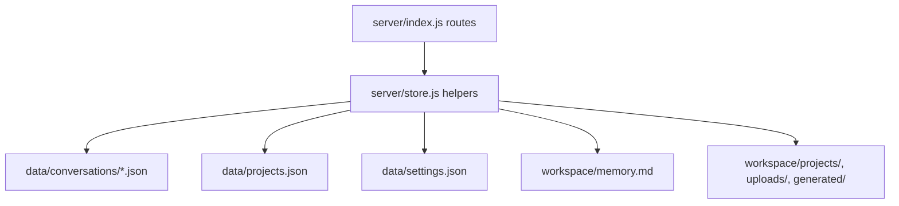

# Persistence

`server/store.js` is a filesystem-backed persistence layer. It treats JSON files as the database for conversations, projects, settings, and memory, and creates required directories at module import time.

## Purpose

Describe where runtime state lives and which `store.js` functions read and write it.

## Key source files

| File | Why it matters |
|---|---|
| `server/store.js` | Path constants, directory creation, and all persistence helpers |
| `.gitignore` | Declares volatile runtime files/directories excluded from git |
| `server/index.js` | Main caller of conversation/project/settings/memory persistence functions |

## Directory layout and constants

`store.js` exports these path constants:

| Constant | Value |
|---|---|
| `ROOT` | repo root (`path.join(__dirname, "..")`) |
| `DATA_DIR` | `ROOT/data` |
| `CONV_DIR` | `DATA_DIR/conversations` |
| `WORKSPACE` | `ROOT/workspace` |
| `UPLOADS_DIR` | `WORKSPACE/uploads` |
| `GENERATED_DIR` | `WORKSPACE/generated` |
| `MEMORY_FILE` | `WORKSPACE/memory.md` |
| `SETTINGS_FILE` | `DATA_DIR/settings.json` |
| `PROJECTS_FILE` | `DATA_DIR/projects.json` |
| `PROJECT_FILES_DIR` | `WORKSPACE/projects` |

On import, it runs `fs.mkdirSync(dir, { recursive: true })` for:
`DATA_DIR`, `CONV_DIR`, `WORKSPACE`, `UPLOADS_DIR`, `GENERATED_DIR`, and `PROJECT_FILES_DIR`.

## Key abstractions

| Name | File | Description |
|---|---|---|
| `convPath(id)` | `server/store.js` | Validates IDs with `/^[\w-]+$/` and resolves `data/conversations/<id>.json` |
| `saveConversation(conv)` | `server/store.js` | Sets `updatedAt`, writes pretty-printed JSON |
| `listProjects` / `createProject` / `updateProject` / `deleteProject` | `server/store.js` | Project CRUD in `projects.json`, plus per-project files dir creation and conversation detachment on delete |
| `readSettings` / `writeSettings` | `server/store.js` | Settings file read/write with defaults fallback |
| `readMemory` / `writeMemory` | `server/store.js` | Direct read/write for `workspace/memory.md` |

## How it works

## Read/write behavior

- Conversations:
  - `listConversations()` scans `CONV_DIR`, reads each JSON, returns metadata sorted by `updatedAt` desc.
  - `getConversation(id)` returns parsed JSON or `null`.
  - `createConversation(projectId)` creates `{ id, title: "New chat", threadId: null, messages: [], createdAt, updatedAt }`.
  - `saveConversation(conv)` updates `updatedAt` and writes the full object.
  - `deleteConversation(id)` unlinks the conversation file if present.
- Projects:
  - `listProjects()` reads `projects.json`, fallback `[]`.
  - `createProject({ name, instructions })` validates name, writes to list, and creates `workspace/projects/<project.id>/`.
  - `updateProject(id, patch)` updates name/instructions.
  - `deleteProject(id)` removes project and sets matching conversations’ `projectId` to `null`.
  - `getProject(id)` returns one project or `null`.
- Settings:
  - `readSettings()` fallback defaults:
    `{ customInstructions: "", nickname: "", memoryEnabled: true, model: "", reasoningEffort: "" }`.
  - `writeSettings(s)` writes full JSON object.
- Memory:
  - `readMemory()` returns file text or `""`.
  - `writeMemory(text)` writes plain text markdown.

Exact object shapes are documented in [Data models](../reference/data-models.md).

## Gitignored runtime state

From `.gitignore`:

- `data/`
- `workspace/uploads/`
- `workspace/generated/`
- `workspace/memory.md`

These are runtime/volatile artifacts and should not be committed.

## Integration points

- API usage: [API index](../api/index.md)
- End-to-end message persistence path: [SSE chat pipeline](./sse-chat-pipeline.md)
- Broader architecture context: [Architecture](../overview/architecture.md)

## Entry points for modification

- Add new persisted records: extend `store.js` with new constants + read/write helpers.
- Tighten filesystem validation: update `convPath` and route-level sanitization callsites.
- Change default settings behavior: `readSettings()` fallback object.
