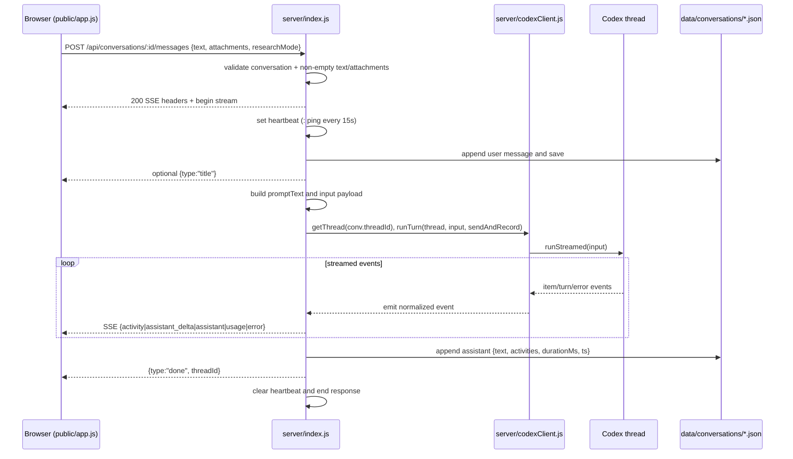

# SSE chat pipeline

`POST /api/conversations/:id/messages` in `server/index.js` is the core turn pipeline: it validates input, opens an SSE stream, runs Codex through `runTurn`, persists both sides of the exchange, and closes with `done` or `error`.

## Purpose

Explain the exact server-side flow from incoming user payload to persisted assistant message and streamed client events.

## Key source files

| File | Why it matters |
|---|---|
| `server/index.js` | Defines the SSE endpoint, message persistence, prompt/input construction, and stream lifecycle |
| `server/codexClient.js` | Implements `runTurn(thread, input, emit)` used by the endpoint |
| `server/prompts.js` | Provides `buildPreamble` and `researchProtocol` used in prompt assembly |
| `public/app.js` | Consumes streamed events via `handleStreamEvent` and renders assistant/activity updates |

## Key abstractions

| Name | File | Description |
|---|---|---|
| `send(data)` | `server/index.js` | Writes `data: <json>\n\n` SSE frames |
| `sendAndRecord(ev)` | `server/index.js` | Streams events and accumulates `activity` items for replay |
| `runTurn(thread, input, emit)` | `server/codexClient.js` | Bridges Codex item events into `assistant`, `assistant_delta`, `activity`, `usage`, `error` |
| `handleStreamEvent(ev, shell, markFinal)` | `public/app.js` | Applies server events to live UI |

## How it works

## Request handling details

1. The handler loads `conv` with `getConversation(req.params.id)` and returns `404` if not found.
2. It reads `{ text = "", attachments = [], researchMode = "" }` and returns `400` on an empty message (`!text.trim() && attachments.length === 0`).
3. It sends SSE headers:
   - `Content-Type: text/event-stream`
   - `Cache-Control: no-cache`
   - `Connection: keep-alive`
   - `X-Accel-Buffering: no`
4. It starts heartbeat comments with `setInterval(() => res.write(": ping\n\n"), 15000)`.

## User message persistence and auto-title

- A user message is pushed to `conv.messages` with:
  - `role: "user"`
  - `text`
  - `attachments: [{ name, url, isImage }]`
  - `ts: Date.now()`
- If `conv.title === "New chat"` and the user sent non-empty text, title is set to:
  - normalized whitespace
  - first 48 chars
  - trailing `…` when truncated
- The new title is streamed with `send({ type: "title", title: conv.title })`.

## Prompt and input construction

- `isFirstTurn = !conv.threadId`.
- `promptText` is assembled in this order:
  1. `buildPreamble(conv.projectId) + "\n\n"` only on first turn
  2. `researchProtocol(researchMode)`
  3. Non-image attachment note with `relPath` list (if any)
  4. Image-count note (if any)
  5. User `text`
- `input` sent to Codex:
  - **No images:** plain string `promptText`
  - **With images:** array with `{ type: "text", text: promptText }` plus one `{ type: "local_image", path: path.join(WORKSPACE, a.relPath) }` per image

Related prompt behavior is documented in [Memory and personalization](../features/memory-and-personalization.md) and [Deep research](../features/deep-research.md).

## Activity capture and assistant persistence

- `activities` is an array local to this request.
- `sendAndRecord(ev)`:
  - for `ev.type === "activity"`, upserts by `id` + `kind` (updates existing entry or pushes new)
  - forwards every event to SSE via `send(ev)`
- On success:
  - `const { threadId, finalText } = await runTurn(thread, input, sendAndRecord)`
  - updates `conv.threadId`
  - appends assistant message:
    - `role: "assistant"`
    - `text: finalText`
    - `activities`
    - `durationMs: Date.now() - startedAt`
    - `ts: Date.now()`
  - saves conversation and streams `{ type: "done", threadId: conv.threadId }`
- On error: logs to server and streams `{ type: "error", message }`.
- In `finally`: clears heartbeat and calls `res.end()`.

## Integration points

- Route reference: [API index](../api/index.md)
- Event mapping internals: [Codex integration](./codex-integration.md)
- UI consumer path: [Frontend architecture](./frontend-architecture.md)
- Project conventions: [Patterns and conventions](../how-to-contribute/patterns-and-conventions.md)

## Entry points for modification

- Update chat transport or event payloads: `server/index.js` SSE handler and `public/app.js` `handleStreamEvent`.
- Change first-turn personalization or research behavior: `server/prompts.js` (see feature docs above).
- Change Codex event semantics: `server/codexClient.js`.
